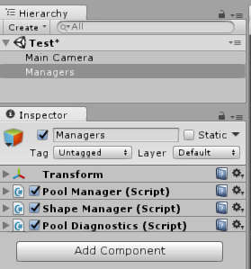
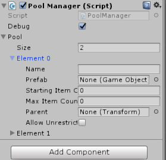

# GameObjectPool

***Average runtime of 0.0001930632 seconds to spawn an object using `PoolManager` based on 5000 iterations.***

Easily create and access pools of GameObjects to save on memory.

`GameObjectPool.Pool` extends `System.Collections.Generic.Queue` and takes
instructions in the form of `PoolSettings` objects.

## PoolSettings

- `Name` - the name of the pool
- `Prefab` - the prefab item that will fill the pool
- `Starting Item Count` - the number of items to initially create
- `Max Item Count` - the number of items to add to the pool before triggering an error message
- `Parent` - transform to parent pooled objects to
- `Allow Unrestricted Growth` - allow pool to continue populating itself with objects after max reached

## Using with a project

### Installation

1. [Get latest GameObjectPool.unitypackage release from Github](https://github.com/mdmnk/GameObjectPool/releases/latest)
2. Import package into project through menu in Unity `Assets > Import package > Custom Package...`
2. Uncheck example if you don't need it
3. Add ObjectPool project to your version control ignore file

### Scene setup

Assign `GameObjectPool.PoolManager` to a game object in your main scene

On that game object script set `Pool > Size` to a number greater than zero and a list of properties called "Element N" will show up

See `PoolSettings` in this file for information regarding the settings available

Clicking on the "Regenerate pool" button will cause the Pool Manager to regenerate (or generate if clicked the first time) the pools according to the settings in the Pool Manager. This allows you to generate GameObjects for the pool within the editor rather than at run-time.

**Note** Items will still be generated at run time if the pool does not have the minimum number of start items in it at run time.

#### Get an object from a pool

`GameObjectPool.PoolManager.Get("PoolName")`

#### Return an object to the pool

Use the standard MonoBehaviour method `SetActive(false)` on the game object you want to disable and it will return to its pool.

## Examples

See **Example > Scenes > Test** for sample usage involving shape spawning.
